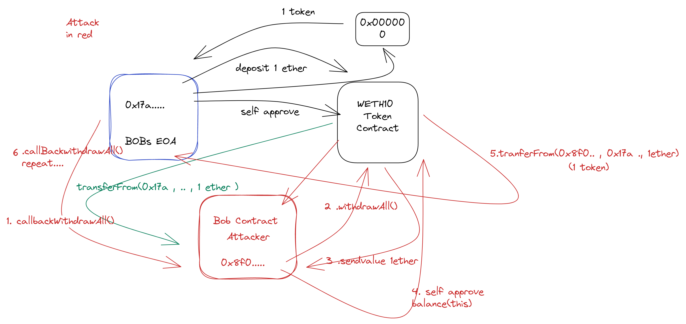

## 0 : SetUp ▶

```bash
git clone "https://github.com/niluk-256/Quill-CTF-foundry.git"

forge install
forge  test   --match-contract {contract} -vvvv


```

| Level  | Description |
| ------ | ----------- |
| Easy   | 🟢          |
| Medium | 🟡          |
| Hard   | 🔴          |

---

## 1 : Road Closed ☑ 🟢

“We keep out the wrong people – by letting anyone in.”
<br>

<li>Objective of CTF </li>

```
Become the owner of the contract
Change the value of hacked to true
```

test Method 1 with EOA

```bash
forge test  --match-contract RoadAttackerSimple -vvv
forge test  --match-contract RoadAttackerSimple -vvvv

```

test Method 2 Contract

```bash
forge test  --match-contract RoadAttackerWithContract -vvvv
```

Even though there is ` isContract` .we can bypasss it because when we execute our logic inside of the constructor(Attacker contract) the code size is zero it won't be included in the runtime code.

## 2 : Confidential Hash ☑ 🟢

<br>

<li>Objective of CTF </li>

```
Find the keccak256 hash of aliceHash and bobHash.
```

test Exploit

```bash

forge test  --match-contract ConfidentialHashExploit  -vvv
forge test  --match-contract ConfidentialHashExploit  -vvvv

```

```
Never store sensitive information in
contract because anyone access it from the storage.
```

#### Learning Resources

[How to read ethereum contract storage](https://medium.com/@dariusdev/how-to-read-ethereum-contract-storage-44252c8af925)

[Resource2 ](https://medium.com/coinmonks/hacking-secrets-in-ethereum-smart-contracts-646c638c395c)

## 3 : VIP Bank ☑ 🟢

“This Bank is only for its VIP Customers.”

<br>

<li>Objective of CTF </li>

```
At any cost, lock the VIP user balance forever into the contract.
```

test Exploit

```bash
forge test  --match-contract VIPBankExploit  -vvvv
```

#### Learning Resources

[Resource1 - Alchemy-SelfDestruct](https://www.alchemy.com/overviews/selfdestruct-solidity)

## 4 : safeNFT ☑ 🟡

“Often something that appears safe isn't safe at all.”

<br>

<li>Objective of CTF </li>

```
Claim multiple NFTs for the price of one.
```

`Attack vector: RE-Entrancy`

```bash
forge test  --match-contract SafeNftExploit  -vvvv
```

#### Learning Resources

[Resource0 -Walkthrough by Erhant](https://dev.to/erhant/quill-ctf-4-safe-nft-5699) <br/>
[Resource1 -Walkthrough by Vishnuram Rajkumar](https://infosecwriteups.com/quillaudit-ctf-challenges-writeups-fd5d38f010a4) <br/>
[Resource2 -Blocksec](https://blocksecteam.medium.com/when-safemint-becomes-unsafe-lessons-from-the-hypebears-security-incident-2965209bda2a)<br/>
[Resource3 -Danger of surpisingcode samczsun](https://samczsun.com/the-dangers-of-surprising-code/)

## 5 : D31eg4t3 ☑ 🟢

This CTF challenge is developed to showcase the <br/>
vulnerability which can be introduced by using delegatecall() incorrectly.

“Handle with care, It’s D31eg4t3”

<br>

<li>Objective of CTF </li>

```
Become the owner of the contract.
Make canYouHackMe mapping to true for your own
address.
```

`Attack vector: Delegatecall`

```bash
 forge test  --match-contract DExploit  -vvvv
```

#### Learning Resources

[Resource Preservation Ethernauts](https://medium.com/coinmonks/ethernaut-lvl-16-preservation-walkthrough-how-to-inject-malicious-contracts-with-delegatecall-81e071f98a12)
<br/>

[Solidity Docs](https://docs.soliditylang.org/en/v0.8.6/introduction-to-smart-contracts.html?highlight=delegatecall) <br/>
[Walkthrough by Vishnuram Rajkumar](https://infosecwriteups.com/quillaudit-ctf-challenges-writeups-fd5d38f010a4) <br/>
[Walkthrough by Erhan Tezcan](https://dev.to/erhant/quillctf-5-d31eg4t3-37h3) <br/>

## 6 :Collatz Puzzle 🔴 ❎

“It's a puzzle I'll keep trying because it's so much fun.”
<br>

<li>Objective of CTF </li>

```
Make a successful call to the callMe function.
You should be the deployer of the contract at the given addr parameter!
```

## 6 : True XOR ☑ 🟡

<br>
<li>Objective of CTF </li>

```
Make a successful call to the `callMe` function.
The given `target` parameter should belong to a contract deployed by you and should use `IBoolGiver` interface.

```

```bash
forge test  --match-contract TrueXORTest  -vvvv
```

### Learning Resources

[Ethernauts level 18 Magic Number](https://www.youtube.com/watch?v=FsPWuKK8mWI)<br/>
[Deconstructing a Solidity Contract ](https://blog.openzeppelin.com/deconstructing-a-solidity-contract-part-i-introduction-832efd2d7737/) <br/>
[viking71](https://infosecwriteups.com/quillaudit-ctf-challenges-writeups-fd5d38f010a4)

## 8. Pelusa ❎

## 9 : WETH10 ☑ 🟡

<br>

<li>Objective of CTF </li>

```
The contract currently has 10 ethers. (Check the Foundry configuration.)
You are Bob (the White Hat). Your job is to rescue all the funds from the contract, starting with 1 ether, in only one transaction.


```

```
bob deposit  1 ether gets a Token
      Aproved himself
      transfer that Token to his bobcontract so now his bob contract has 1 token
      bob call callWithdrawAll then ..we can withdraw 1 ether,  to our Attacker Contract ... before going to _burnAll() (WETH10 Line 29) we gonna
        send those tokens to bob's EOA  ..repeat it 10 times, we withdraw all the ether in bobContract then  finally we withdraw the rest (1 remaining ether) by directly calling  withdrawAll function in WETH10

```



```bash
forge test  --match-contract WETHAttack  -vvvv
```

### Learning Resources

Credits viking71 for explaining this level
https://infosecwriteups.com/quillaudit-ctf-challenges-writeups-fd5d38f010a4

---

<br/>

#### please open a PR on the repo if you wish to contribute💙 .

#### Please only publish solutions for retired the challenges check here👇

[quillCTF challenges](https://quillctf.super.site/challenges)
